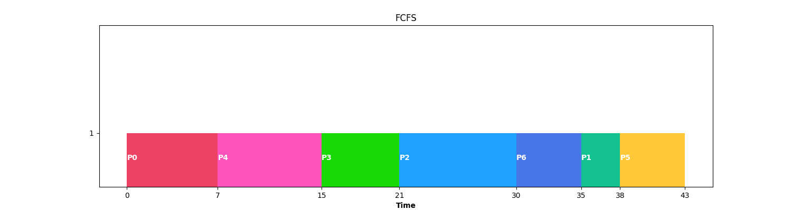
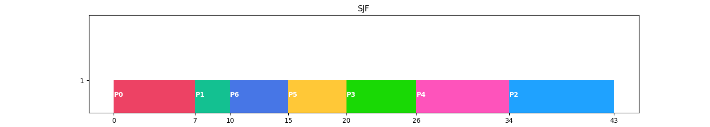
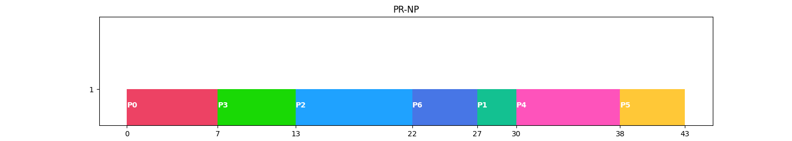
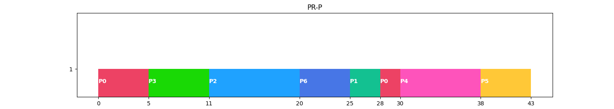
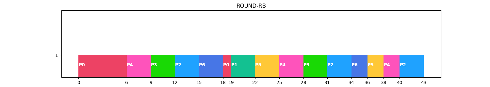
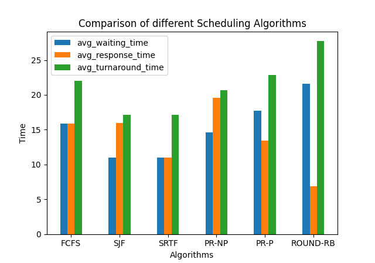

# CPU-Scheduling-Simulator
Python project to simulate cpu-scheduling

## Up and Running
To run the project
- install dependencies.
    - `pip install -e .` (if in virtual environment)
    - `python setup.py install` (otherwise)
- in the project root directory run
        `python main.py`

## Developing
1. Clone the project
    - `git clone https://github.com/prashant-th18/cpu-scheduling-simulator.git`
    - navigate to the project directory.
    - create/navigate to your branch. `git branch -b <your-name>`
2. Create a virtual environment.
    - if you don't have virtualenv installed install using pip. `pip install virtualenv`
    - create virtual environment. `virtualenv env`
3. Activate virtual env.
    - `source env/bin/activate`
    - when you are done doing stuff you can deactivate virtual env writing directly `deactivate`
4. install dependencies and setup tools. `pip install -e .` 

5. Do stuff.

## Documentation
### Demo
`src.app.main()`
<details>
  <summary>source</summary>
  
  ```python3
import src.algorithms.fcfs as fcfs
import src.algorithms.sjf as sjf
import src.algorithms.priority_np as priority
import src.algorithms.priority_preemptive as priority_preemptive
import src.algorithms.round_robin as rr
import src.algorithms.srtf as srtf
from src.utils.test import processes  # test processes
import src.utils.graph as graph
import src.utils.table as table

# Actual App logic goes in this main function. Like all the options to choose from algorithms input outputs etc.


def main():
    """
    **Demo**
        - This function runs sample (random) testcase with 7 process to demonstrate the app
        - Plots the gantt chart for each algorithm
        - Plots the comparision graph for different algorithms
    **to Run Demo:**
        - unzip the project.
        - In the project base directory
            - configure Python virtual Environment.
                - create virtual env : ``python3 -m venv env``
                - switch to environment.
                    - Linux : ``source env/bin/activate``
                    - Win : run the `activate` script in cmd at ``env/sources/activate`` and then change back to the root directory.
            - install dependencies
                - ``pip install -e .``
        - in the project root directory run ``python main.py``
    """
    rs_fcfs = fcfs.run(processes)
    rs_sjf = sjf.run(processes)
    rs_pr = priority.run(processes)
    rs_prp = priority_preemptive.run(processes)
    rs_srtf = srtf.run(processes)
    rs_rr = rr.run(processes)

    print('\n FCFS')
    table.plot(rs_fcfs['processes'])
    graph.plot_gantt(rs_fcfs)

    print('\n SJF')
    table.plot(rs_sjf['processes'])
    graph.plot_gantt(rs_sjf)

    print('\n PR')
    table.plot(rs_pr['processes'])
    graph.plot_gantt(rs_pr)

    print('\n PRP')
    table.plot(rs_prp['processes'])
    graph.plot_gantt(rs_prp)

    print('\n SRTF')
    table.plot(rs_srtf['processes'])
    graph.plot_gantt(rs_srtf)

    print('\n RR')
    table.plot(rs_rr['processes'])
    graph.plot_gantt(rs_rr)

    graph.plot_comparison(
        [rs_fcfs, rs_sjf, rs_srtf, rs_pr, rs_prp, rs_rr])


if __name__ == '__main__':
    main()
  ```
</details>

* **Demo**
    * This function runs sample (random) testcase with 7 process to demonstrate the app
    * Plots the gantt chart for each algorithm
    * Plots the comparison graph for different algorithms
* **to Run Demo**
    * unzip the project.
    * In the project base directory
        * configure Python virtual Environment.
            * create virtual env : `python3 -m venv env`
            * switch to environment.
                * Linux : `source env/bin/activate`
                * Win : run the *activate* script in cmd at `env/sources/activate` and then change back to the root directory.

        * install dependencies
            * `pip install -e .`
    * in the project root directory run `python main.py`








